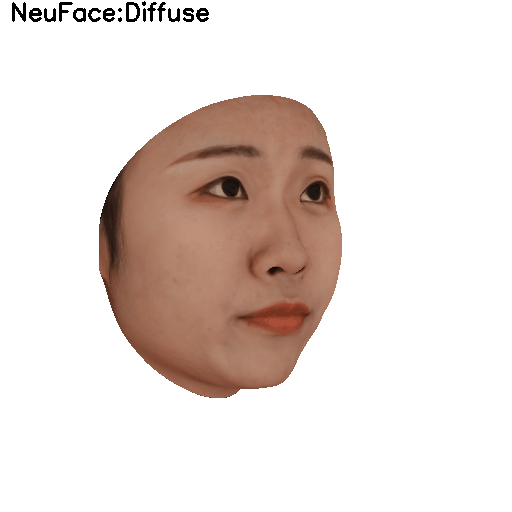
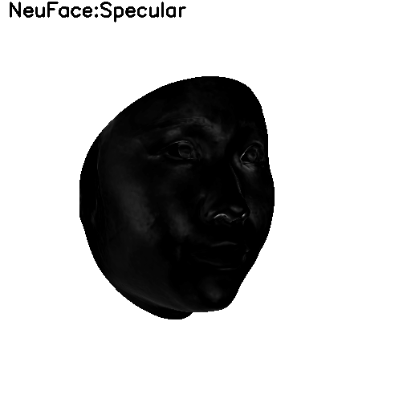
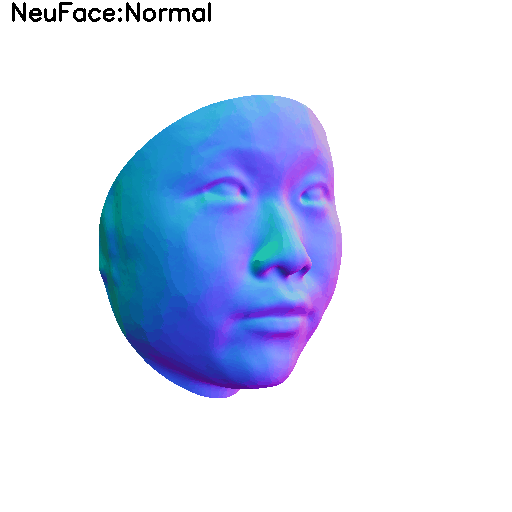
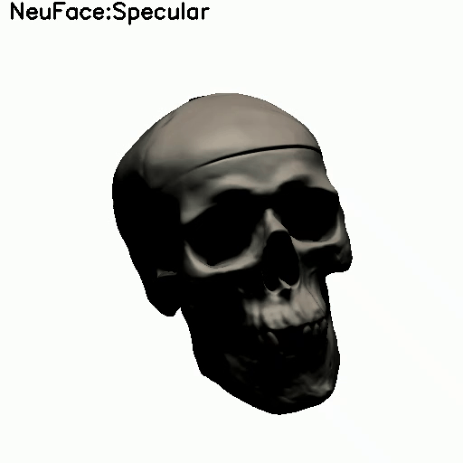
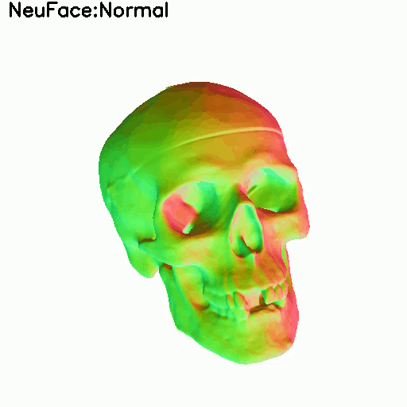

# NeuFace: Realistic 3D Neural Face Rendering from Multi-view Images [CVPR 2023]

###  [Paper](https://arxiv.org/abs/2303.14092)

<a href="https://github.com/MingwuZheng" target="_blank">Mingwu Zheng</a>, <a href="https://github.com/aejion" target="_blank">Haiyu Zhang</a>, <a href="https://scholar.google.com/citations?user=dnbjaWIAAAAJ&hl=zh-CN" target="_blank">Hongyu Yang</a>, <a href="https://irip.buaa.edu.cn/dihuang/index.html" target="_blank">Di Huang</a>






Official code for CVPR 2023 paper NeuFace: Realistic 3D Neural Face Rendering from Multi-view Images.

The paper presents a novel 3D face rendering model, namely **NeuFace**, to learn accurate and physically-meaningful underlying 3D representa
tions by neural rendering techniques.

NeuFace naturally incorporates low-rank neural BRDFs into physically based rendering, allowing it to capture facial geometry and complex appearance properties collaboratively, which enhances its robustness against *specular* reflections. Additionally, NeuFace exhibits commendable generalization abilities when applied to common objects.


## Installation Requirmenets
The code is compatible with python 3.6.13 and pytorch 1.9.1.
To create an anaconda environment named `neuface` with the required dependencies, run:

```
conda create -n neuface python==3.6.13
conda activate neuface
pip install -r requirement.txt
```

## Usage
### Data and shape prior
For human face, We use data from <a href="https://facescape.nju.edu.cn/" target="_blank">FaceScape Dataset</a> to evaluate our model. The detailed 3D mesh is used to generate a mask of each image's face area.  For more information about the data preprocessing of 3D mesh, refer to <a href="https://arxiv.org/abs/2203.14510" target="_blank">ImFace</a>. The ImFace model can be download from <a href="https://drive.google.com/drive/folders/1ljTo2QHT5C1e9-Q9MZhU9HmrqvyExoe6?usp=sharing" target="_blank">pretrained-model</a>.

For common objects, the <a href="https://www.dropbox.com/sh/5tam07ai8ch90pf/AADniBT3dmAexvm_J1oL__uoa" target="_blank"> DTU dataset</a> is used for model evaluation.

### Train on Facescape
To train NeuFace on Facescape dataset, run:
```
python scripts/train_pl.py
```
Make sure that the variables in your config file are correct. Results can be found in `{out_dir}/{expname}`.
The trained model can be downloaded from (FaceScape's author allows to release the trained model):

| Trained Model            | Description  |
|-------------------|-------------------------------------------------------------|
| <a href="https://drive.google.com/drive/folders/1bPtSOnC4OrzU2px6TWOFqv4Xro9h6bW9?usp=sharing" target="_blank">NeuFace_1_id_2_exp</a> | train on 1 id with 2 exp (smile) of Facescape dataset |

If you want to use our trained model, please place the downloaded file in `exp_pl/ckpt/{trained_model}`.
### Evaluation on Facescape
To evaluate the novel view metrics, run:
```
 python scripts/eval_pl.py --ckpt [ckpt_path] --out_dir [our_dir]
```
Results can be found in `{our_dir}/test/{expname}`.

### Train on DTU
To train NeuFace on DTU dataset, run:
```
cd common_object
python training/exp_runner.py --conf ./confs/dtu_fixed_cameras.conf --scan_id [scan_id] --gpu [GPU_ID]
```
Make sure that `[dataset.data_dir]` in your config file is correct. The results can be found in `common_object/exps/{train.expname}/{timestamp}`. The trained model can be downloaded from:

| Trained Model            | Description  |
|-------------------|-------------------------------------------------------------|
| <a href="https://drive.google.com/drive/folders/1AS0FJRku4PJ4zbfB6CQdzYCNcsvBblmZ?usp=sharing" target="_blank">NeuFace_DTU_65</a> | train on 65 scan of DTU dataset |
| <a href="https://drive.google.com/drive/folders/1CAERoMTNUJwp1icElWFQB0hopRQHtNgk?usp=sharing" target="_blank">NeuFace_DTU_110</a> | train on 110 scan of DTU dataset |
| <a href="https://drive.google.com/drive/folders/11hj2PRxYCGL42dHXUNnyD5PgRUsJoZMC?usp=sharing" target="_blank">NeuFace_DTU_118</a> | train on 118 scan of DTU dataset |


If you want to use our trained model, please place the downloaded file in `common_object/exps/{trained_model}`.

### Evaluation on DTU
To evaluate the training view metrics, run:
```
cd common_object
python evaluation/eval.py  --conf ./confs/dtu_fixed_cameras.conf --scan_id [SCAN_ID] --eval_rendering --gpu [GPU_INDEX]
```
Results can be found in `common_object/evals/{train.expname}/rendering`.
## Citation
If you find our work useful in your research, please consider citing:
```
@inproceedings{zheng2023neuface,
title={NeuFace: Realistic 3D Neural Face Rendering from Multi-view Images},
author={Zheng, Mingwu and Zhang Haiyu and Yang, Hongyu and Huang, Di},
booktitle={Proceedings of the IEEE/CVF Conference on Computer Vision and Pattern Recognition},
year={2023}
}
```
## Acknowledgments
- The codebase is developed based on <a href="https://github.com/lioryariv/volsdf" target="_blank">VolSDF</a> and <a href="https://github.com/lioryariv/idr" target="_blank">IDR</a> of Lior et al. Many thanks to their great contributions!
- This paper is based on <a href="https://arxiv.org/abs/2203.14510" target="_blank">ImFace</a> (CVPR 2022), welcome to pay attention!
